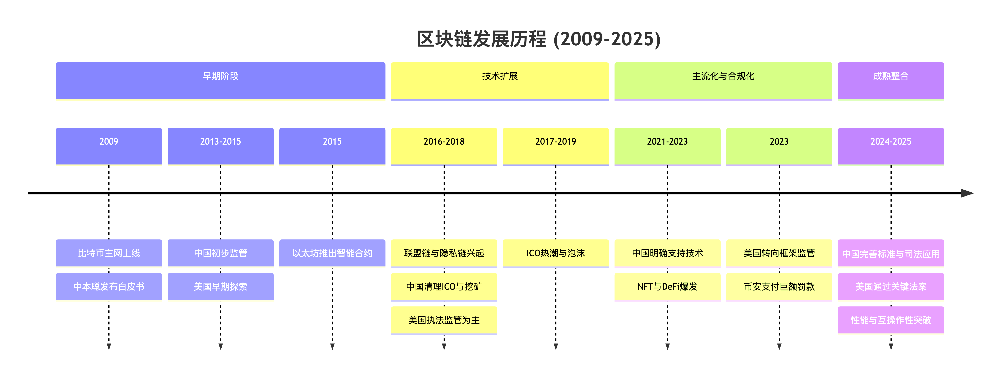

# 区块链历程

<figure><figcaption></figcaption></figure>

**一、 行业发展阶段、热点与主要产品**

1. **第一阶段：起源与探索 (2009 - 2015)**
   * **热点**：数字货币的概念验证、点对点电子现金。
   * **主要产品/技术**：
     * **比特币 (Bitcoin)**：首个区块链应用， Proof-of-Work 共识机制。
     * **山寨币 (Altcoins)** 出现：如莱特币 (Litecoin, 2011)。
     * **侧链技术**：Blockstream 提出 (2014)。
     * **支付网络**：瑞波币 (Ripple, 2013)。
     * **早期探索**：名称币 (Namecoin) 等非金融应用尝试。
2. **第二阶段：扩展与泡沫 (2015 - 2020)**
   * **热点**：智能合约、ICO (首次代币发行)、联盟链、隐私保护。
   * **主要产品/技术**：
     * **以太坊 (Ethereum)**：引入智能合约，引爆 dApp 生态。
     * **ICO 狂潮与泡沫**：基于以太坊 ERC-20 标准的众筹模式。
     * **联盟链兴起**：Hyperledger Fabric (2015), R3 Corda。
     * **隐私币**：Zcash (2016), Monero。
     * **基础设施**：跨链技术早期探索、IPFS (分布式文件存储)。
3. **第三阶段：DeFi 夏季与主流化 (2020 - 2023)**
   * **热点**：DeFi (去中心化金融)、NFT (非同质化代币)、Layer 2 扩容、元宇宙。
   * **主要产品/技术**：
     * **DeFi 协议**：Uniswap (AMM 做市商), Aave, Compound (借贷)。
     * **NFT 与数字藏品**：CryptoPunks, Bored Ape Yacht Club, 各平台数字藏品。
     * **跨链生态**：Polkadot (基于 Substrate, 2018), Cosmos。
     * **Layer 2 解决方案**：Optimism, Arbitrum, StarkNet 等 Rollup 技术。
     * **中心化交易所 (CEX) 主导**：Binance, Coinbase 等。
4. **第四阶段：合规化与大规模应用 (2023 - 2025)**
   * **热点**：RWA (真实世界资产代币化)、合规稳定币、CBDC (央行数字货币)、区块链与 AI 结合。
   * **主要产品/技术**：
     * **合规金融产品**：贝莱德、富达等机构推出的比特币现货 ETF。
     * **Token化国债/债券**：传统金融资产上链。
     * **CBDC 试点与落地**：多国进入测试阶段。
     * **模块化区块链与互操作性**：Celestia, EigenLayer 等。
     * **性能成熟**：以太坊完成系列升级，Layer 2 性能大幅提升。
     * **企业级应用普及**：在供应链、政务、身份认证等领域广泛应用。

