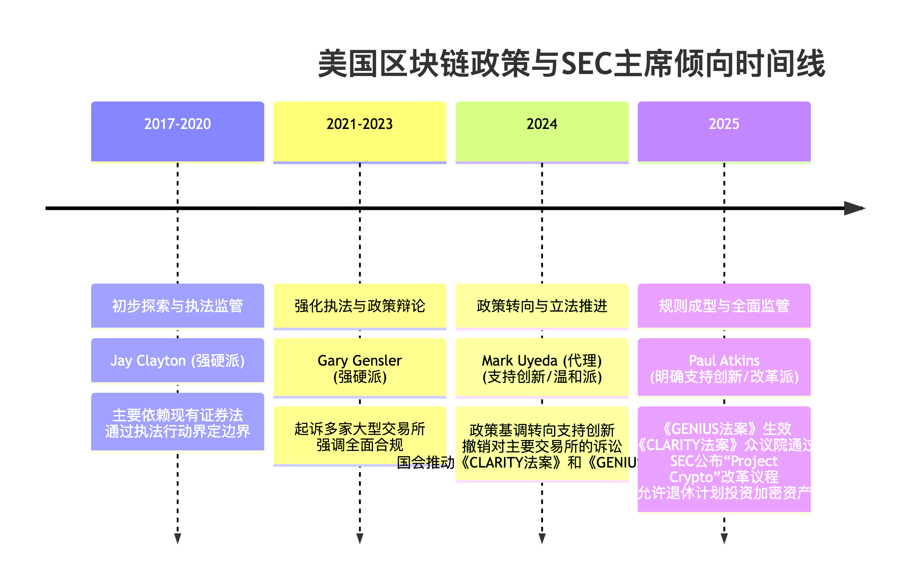

# 🇺🇸 美国监管

<figure><figcaption></figcaption></figure>

#### 📜 美国关键区块链政策

近些年，美国在区块链和加密货币领域的监管框架经历了显著的变化，逐步从早期主要依靠执法监管，转向更具建设性、以规则制定为先的监管模式。

1. **《CLARITY 法案》**（**2024年众议院通过，2025年持续推进**）
   * **核心内容**：该法案旨在明确代币应由美国商品期货交易委员会（CFTC）还是证券交易委员会（SEC）管辖的核心标准。它通过确立区块链系统是否获得SEC认证为“**成熟系统**”的**七项标准**来划分数字资产应归类为“**数字商品**”（CFTC管辖）或“**证券**”（SEC管辖）。一旦系统被认证为成熟，其原生代币可作为数字商品在CFTC监管下交易。
   * **影响**：为数字资产提供了清晰的监管分类标准，为资产从SEC管辖向CFTC转移提供了明确路径，降低了市场的不确定性。
2. **《GENIUS 法案》**（**2025年7月正式生效**）
   * **核心内容**：这是美国**首部全面规范稳定币的联邦法律**。该法案将发行资格限定于受监管实体，要求发行方必须持有100%的储备资产（仅限于美元、短期美国国债等高质量流动资产），并严格隔离稳定币业务与高风险活动。
   * **影响**：为稳定币发行提供了统一的联邦监管框架，增强了稳定币的可信度和稳定性，推动了其在银行、零售、卡组织等行业的规模化应用。
3. **退休计划投资新政**（**2025年8月签署**）
   * **核心内容**：允许401(k)等退休计划通过ETF等渠道配置加密资产。
   * **影响**：为加密货币市场带来了庞大的潜在机构资金流入，进一步推动了数字资产的主流化进程。
4. **SEC规则制定议程（"Project Crypto"）**（**2025年9月公布**）
   * **核心内容**：SEC公布了新的规则制定议程，其中包括针对数字资产发行与销售的规则提案（可能包含特定豁免条款及安全港规则），以及考虑修改规则允许加密货币在全国性证券交易所及另类交易系统进行交易。
   * **影响**：体现了美国证券交易委员会对支持创新、资本形成、市场效率及投资者保护的重新聚焦，旨在为数字资产行业提供“量身定制”的规则，促使加密货币与传统金融体系更深度融合。

#### 👨💼 历任SEC主席的加密货币监管倾向

SEC主席的态度对美国加密货币监管政策有着深远的影响。

1. **Jay Clayton（2017-2020年）**：**倾向：强硬派**
   * **立场**：任期内强调绝大多数ICO（首次代币发行）属于证券发行，必须遵守联邦证券法。对批准比特币ETF持非常谨慎的态度，认为市场存在操纵和流动性问题。
   * **主要举措**：SEC发起了一系列针对ICO项目的执法行动，打击涉嫌欺诈和非注册证券发行的行为。
2. **Gary Gensler（2021-2023年）**：**倾向：强硬派（但技术认知深刻）**
   * **立场**：认为除了比特币以外，绝大多数加密货币都属于证券，应纳入SEC监管范围。强调加密货币交易平台必须向SEC注册，并全面遵守证券法规，以保护投资者。
   * **主要举措**：SEC加强了对加密货币领域的执法力度，起诉了Coinbase、Binance等多家大型交易所；同时，也对一批比特币现货ETF的申请进行了审慎评估。
3. **Mark Uyeda（代理，2023-2024年）**：**倾向：支持创新/温和派**
   * **立场**：在其代理主持工作期间，SEC宣布稳定币、工作量证明挖矿代币和迷因币不在SEC管辖范围内，并放弃了一些与数字资产相关的重大执法行动。
   * **主要举措**：其领导下的SEC推迟实施了多个Gensler时代的规则，并放宽了股东提案监管，显示出与前任不同的监管节奏和重点。
4. **Paul Atkins（2025年4月确认上任至今）**：**倾向：明确支持创新/改革派**
   * **立场**：主张为加密资产提供**清晰的规则和合规路径**，而非仅仅依靠执法。支持将加密资产整合至传统金融体系，并强调监管需要适应技术创新。他领导的SEC公布了包含加密货币政策改革的议程，并撤销了前任提起的一些针对加密货币交易所的诉讼。
   * **主要举措**：推进“Project Crypto”愿景，旨在重新聚焦委员会对支持创新、资本形成、市场效率及投资者保护的关注。支持国会通过的《GENIUS 法案》等加密资产立法。

#### 💎 总结

美国的区块链监管政策经历了从**早期以执法监管为主**、相对不友好的态度，逐步转向更具建设性、**以规则制定为先**的监管模式。这一转变在2024年特朗普政府上任后尤为明显，并通过《CLARITY法案》、《GENIUS法案》等一系列立法举措得以体现。

SEC主席的个人倾向对监管风向有显著影响，从Clayton和Gensler时期的“**强硬执法**”到Atkins时期的“**规则制定与融合**”思路，政策发生了显著变化。目前，美国正致力于建立更清晰、全面的联邦监管框架，以在保护投资者、防范风险的同时，促进区块链技术和加密货币行业的创新与发展。

